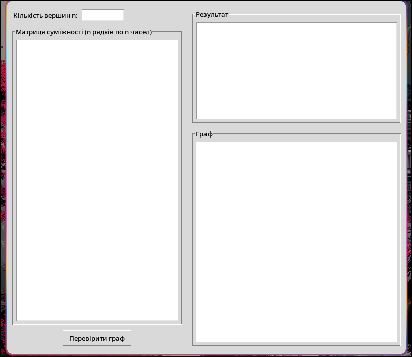

# Graph — Визначення Ейлерового Шляху та Циклу + Візуалізація Графа

Цей проєкт реалізує програму для роботи з **неорієнтованими мультиграфами**, заданими **матрицею суміжності**.  
Програма визначає:

- чи має граф **ейлерів цикл**,  
- чи має граф **ейлерів шлях**,  
- або не є ейлеровим,  
- і будує відповідний шлях/цикл, якщо він існує.

Окрім цього, програма має **графічний інтерфейс (Tkinter)** та **автоматичну візуалізацію графа** на Canvas.

---

## 📌 Функціональність

- Зчитування кількості вершин `n` та матриці суміжності.
- Перевірка коректності введеної матриці.
- Обчислення ступенів усіх вершин.
- Перевірка зв’язності графа.
- Визначення:
  - ейлерового циклу,
  - ейлерового шляху,
  - або відсутності ейлеровості.
- Побудова маршруту (алгоритм Хіерхольцера).
- Візуалізація графа:
  - вершини розташовані по колу,
  - ребра малюються лініями,
  - кратні ребра підписуються множинністю,
  - петлі малюються як окремі овали.

---

## 🖥️ Скриншот інтерфейсу (Приклад)



---

## 🚀 Запуск програми

### **Необхідні пакети (Arch Linux):**

```bash
sudo pacman -S python tk tcl


Tkinter працює одразу після встановлення tk і tcl.

Запуск:
python main.py

📘 Теорія, яка використовується
Умова існування Ейлерового Циклу:

усі вершини мають парний ступінь;

граф є зв’язним (ігноруючи ізольовані вершини).

Умова існування Ейлерового Шляху:

рівно 2 вершини мають непарний ступінь;

граф є зв’язним.

Якщо непарних вершин > 2 — граф не ейлерів.
Алгоритм побудови шляху/циклу:

використовується алгоритм Хіерхольцера.

📂 Структура проєкту
Graph/
│
├── main.py        # Головний файл програми з GUI і логікою
└── README.md      # Опис проєкту

✨ Особливості реалізації

Графічний інтерфейс побудований на Tkinter — працює на всіх ОС.

Візуалізація графа виконується через Canvas.

Вершини рівномірно розташовані по колу (тригонометрична генерація координат).

Програма повністю працює з:

кратними ребрами,

петлями,

довільною кількістю вершин.

👤 Автор

Kabar Mykhailo (merrclop)
GitHub: https://github.com/merrclop

📄 Ліцензія

Цей проєкт можна використовувати для навчальних цілей, лабораторних робіт та досліджень з теорії графів.
